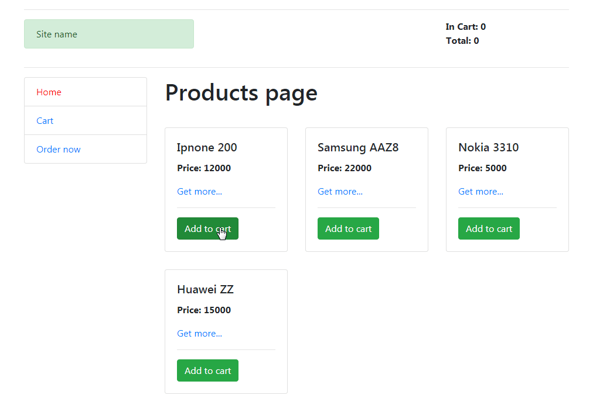

# React online store

This project was created as part of the React library training, on the course of Dmitry Lavrik.

The project implements some of the features of a real online store. The goal of the project was to learn how to work with React, use a data warehouse, server requests and other technologies.

## Technology stack

* Html
* Css
* Js
* React
* MobX
